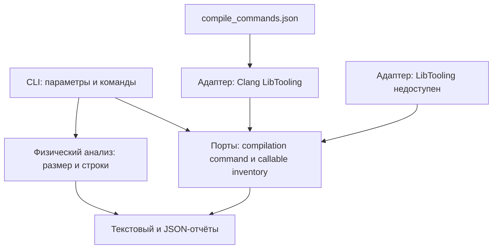
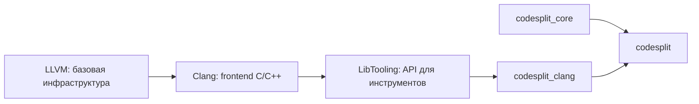
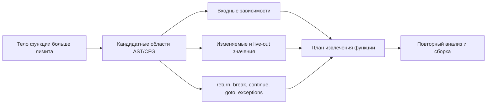
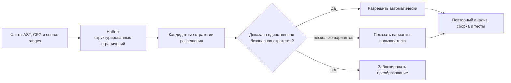
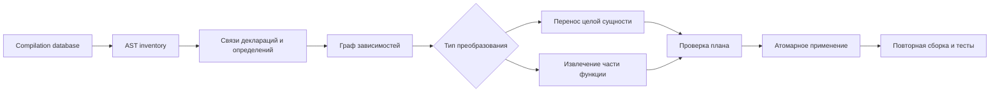

# Архитектура CodeSplit

## Назначение

CodeSplit должен безопасно разделять крупные файлы C и C++ на меньшие файлы, сохраняя
компилируемость и поведение программы. Безопасность преобразования важнее возможности обработать
любой входной файл автоматически.

## Текущая архитектура

`codesplit_core` не зависит от типов LLVM и Clang. `codesplit_clang` предоставляет одну из двух
реализаций общего интерфейса: настоящую загрузку compilation database или явный результат о
недоступности LibTooling.

## Границы зависимостей

Публичные модели CodeSplit используют только стандартные C++-типы. Объекты `clang::ASTContext`,
`clang::Decl`, `clang::SourceManager` и другие типы frontend не должны выходить за границу
`src/clang`.

Текущая AST-инвентаризация возвращает собственные структуры `CallableDefinition` и
`CallableConstraint`. Она находит определения свободных функций и out-of-line методов в основном
файле, вычисляет строки, байтовые смещения и размер исходного диапазона. Макросы и слишком большие
сущности не отбрасываются молча: они остаются в отчёте вместе с причинами, ограничивающими
преобразование. Каноническая декларация Clang связывает out-of-line метод с точным объявлением и
классом-владельцем, включая перегруженные методы. Наружу эта связь выходит как собственные
`SourceRange` и строковый `symbol_id`, сформированный из USR; указатели AST не покидают адаптер.

## Уровни декомпозиции

### Перенос целых семантических единиц

Первый уровень сохраняет внутреннее устройство переносимого кода:

- перенос определения свободной функции в другой `.c` или `.cpp`;
- перенос объявления класса в отдельный `.h` или `.hpp`;
- перенос out-of-line реализаций методов класса в отдельный `.cpp`;
- перенос связанных include и forward declaration;
- обновление мест подключения нового заголовка.

Такое преобразование работает с границами деклараций AST. Оно остаётся нетривиальным из-за
шаблонов, inline-методов, макросов, include-циклов и требований к полноте типов, но не меняет тело
функции.

### Декомпозиция большой функции или метода

Если одна функция или один метод превышает целевой размер файла, перенос целой функции не решает
задачу. Необходимо выделить часть тела в новую функцию или метод.

Этот уровень требует не только AST, но и анализа потока управления и данных. Автоматическое
извлечение запрещается, если CodeSplit не может доказать сохранение области видимости, времени
жизни объектов и управляющего поведения.

## Инварианты безопасности

1. Анализ использует настоящую команду компиляции или явно предоставленные пользователем флаги.
2. Ошибки frontend не скрываются и блокируют изменяющие операции.
3. Код из macro expansion не переносится как обычный текст.
4. Сначала строится и проверяется план изменений, затем выполняется запись.
5. Набор изменений применяется атомарно либо не применяется вовсе.
6. После преобразования повторяются синтаксический анализ, сборка и тесты проекта, если они
   доступны.
7. При неоднозначности инструмент формирует диагностический результат вместо предположения.

## Разрешение конфликтов

Конфликт считается разрешённым не потому, что инструмент выбрал правдоподобный текст, а потому,
что применённая стратегия сохранила обязательные инварианты и прошла проверку. Подробная политика
зафиксирована в ADR 0002.

## Целевой конвейер

Исходники Mermaid хранятся в Markdown. Экспортированные материалы для презентации помещаются в
`docs/generated/` и не отслеживаются git.
